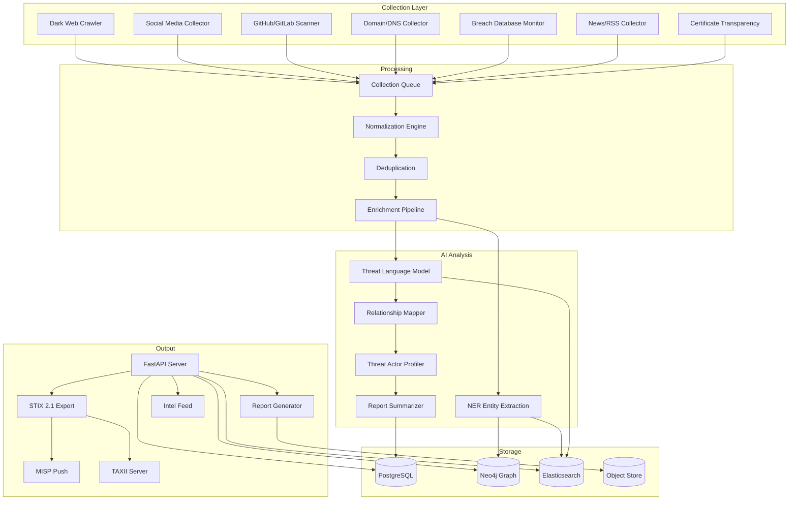

<p align="center">
  
  
  
  
  
  
  
</p>

<p align="center">
  <b>OSINT Threat Intelligence</b><br/>
  Open-source data collection, dark web monitoring, threat actor profiling, and intelligence report generation.
</p>

---

## 📋 Description

**Kirov OSINT Intelligence** is a comprehensive open-source threat intelligence platform that collects, analyzes, and reports on cyber threats from publicly available sources. It monitors the dark web, social media, code repositories, domain registrations, and data breach archives to build actionable threat intelligence.

The platform uses AI-powered analysis to extract entities, relationships, and patterns from unstructured data, building detailed threat actor profiles with their TTPs, infrastructure, and targeting patterns. All intelligence is structured in STIX 2.1 format for seamless integration with the Kirov security ecosystem and external threat intelligence platforms (MISP, TAXII).

---

## 🏗️ Architecture



---

## ✨ Key Features

- **🌐 Dark Web Monitoring** — Automated Tor hidden service crawling with session rotation, CAPTCHA handling, and content categorization
- **📱 Social Media Intelligence** — Threat actor tracking across Telegram, Discord, Reddit, X/Twitter, and illicit forums
- **💻 Code Repository Scanning** — GitHub, GitLab, and Bitbucket monitoring for leaked credentials, vulnerability discussions, and exploit code
- **🌍 Domain Intelligence** — Certificate Transparency log monitoring, domain registration tracking, DNS analytics, and homograph domain detection
- **🔓 Breach Data Monitoring** — Continuous monitoring of breach archives, paste sites, and credential dumps
- **🧠 AI-Powered Entity Extraction** — Custom NER model trained on threat intelligence sources for extracting IOCs, threat actors, tools, and techniques
- **👤 Threat Actor Profiling** — Automated profile generation with aliases, associated campaigns, TTPs, targets, and infrastructure clusters
- **📊 Relationship Mapping** — Neo4j graph database showing complex relationships between actors, malware, infrastructure, and campaigns
- **📝 Automated Report Generation** — Structured intelligence reports (PDF, HTML, STIX bundles) with customizable templates
- **🔄 Intelligence Sharing** — Native MISP, TAXII, and OpenCTI integration for bidirectional intelligence exchange
- **🔍 IOC Extraction** — Automatic extraction and enrichment of IPs, domains, URLs, hashes, email addresses, and crypto wallet addresses

---

## 🛠️ Tech Stack

| Category | Technology |
|----------|-----------|
| **Backend** | FastAPI 0.110+ (Python 3.11+) |
| **Web Scraping** | Selenium, Playwright, Scrapy, aiohttp |
| **Dark Web** | Stem (Tor controller), Torsocks, custom SOCKS proxy rotator |
| **AI/NLP** | Hugging Face Transformers, spaCy, LangChain |
| **NER Model** | Custom fine-tuned RoBERTa for threat intelligence |
| **Graph Database** | Neo4j 5 |
| **Search** | Elasticsearch 8 |
| **Relational DB** | PostgreSQL 16 |
| **Object Store** | MinIO |
| **Intel Formats** | STIX 2.1, MISP JSON, TAXII 2.1, CSV, PDF |
| **Containerization** | Docker, Docker Compose |
| **Task Queue** | Celery + RabbitMQ |
| **Message Queue** | Apache Kafka |

---

## 🚀 Quick Start

### Prerequisites

- Python 3.11+, Docker and Docker Compose
- Tor daemon (for dark web crawling) — included in Docker Compose
- API keys for commercial threat intel feeds (optional)

### Installation

```bash
# Clone the repository
git clone https://github.com/Raphasha27/kirov-osint-intelligence.git
cd kirov-osint-intelligence

# Copy environment configuration
cp .env.example .env
# Edit .env with collector API keys and configuration

# Start with Docker Compose
docker compose up -d

# Or run locally:
cd server
python -m venv venv
source venv/bin/activate  # Windows: venv\Scripts\activate
pip install -r requirements.txt
uvicorn app.main:app --reload --port 8000
```

### Configure Collectors

```bash
# Enable dark web collector
curl -X POST http://localhost:8000/api/v1/collectors \
  -H "Content-Type: application/json" \
  -d '{"name": "dark-web", "enabled": true, "config": {
    "max_depth": 2, "crawl_interval_hours": 6,
    "seed_urls": ["http://xyz...onion/"],
    "tor_ports": {"socks": 9050, "control": 9051}
  }}'

# Add Telegram monitoring
curl -X POST http://localhost:8000/api/v1/collectors \
  -H "Content-Type: application/json" \
  -d '{"name": "telegram", "enabled": true, "config": {
    "api_id": "YOUR_API_ID", "api_hash": "YOUR_API_HASH",
    "channels": ["@threatactors", "@leakforum"]
  }}'
```

### Generate Intelligence Report

```bash
# Generate threat actor report
curl -X POST http://localhost:8000/api/v1/reports/generate \
  -H "Content-Type: application/json" \
  -d '{"type": "threat_actor", "id": "TA001", "format": "pdf"}'

# Export intelligence as STIX bundle
curl -X POST http://localhost:8000/api/v1/intel/export \
  -H "Content-Type: application/json" \
  -d '{"format": "stix2", "date_range": {"start": "2026-01-01", "end": "2026-06-01"}}'
```

---

## 📡 API Overview

| Endpoint | Method | Description |
|----------|--------|-------------|
| `/api/v1/health` | GET | Health check |
| `/api/v1/collectors` | GET/POST | List/configure collectors |
| `/api/v1/collectors/:id/run` | POST | Trigger collector run |
| `/api/v1/threat-actors` | GET | List threat actor profiles |
| `/api/v1/threat-actors/:id` | GET | Actor profile details |
| `/api/v1/threat-actors/:id/graph` | GET | Actor relationship graph |
| `/api/v1/iocs` | GET | List collected IOCs |
| `/api/v1/iocs/search` | POST | IOC search with filters |
| `/api/v1/intel/import` | POST | Import STIX/MISP bundle |
| `/api/v1/intel/export` | POST | Export intelligence data |
| `/api/v1/reports/generate` | POST | Generate intelligence report |
| `/api/v1/reports` | GET | List generated reports |
| `/api/v1/campaigns` | GET | List tracked campaigns |
| `/api/v1/feeds` | GET | List active intel feeds |

---

## 🔗 Integration with Kirov Ecosystem

| Component | Integration |
|-----------|-------------|
| **[Threat Hunter](https://github.com/Raphasha27/kirov-threat-hunter)** | Supplies enriched IOCs and threat actor TTPs for hunting operations |
| **[Security Dashboard](https://github.com/Raphasha27/kirov-security-dashboard)** | OSINT collection metrics and threat landscape overview |
| **[Phishing Detection](https://github.com/Raphasha27/kirov-phishing-detection-engine)** | Feeds new phishing domains and brand impersonation campaigns |
| **[Malware Analysis Lab](https://github.com/Raphasha27/kirov-malware-analysis-lab)** | Dark web malware sample collection and download |
| **[Cyber Automation Engine](https://github.com/Raphasha27/kirov-cyber-automation-engine)** | Triggers intelligence enrichment playbooks on new threat actor discovery |
| **[Network Defense](https://github.com/Raphasha27/kirov-network-defense-platform)** | Feeds OSINT-derived C2 infrastructure for network blocking |

---

## 🔒 Security Considerations

- **Collector Anonymity**: Dark web and sensitive collectors route through Tor with automatic circuit rotation. SOCKS proxies are isolated in separate containers.
- **Data Storage**: Collected intelligence data is encrypted at rest. Raw collected content has configurable retention (default 30 days), while analyzed intelligence is retained permanently.
- **Legal Compliance**: The platform is designed for authorized intelligence gathering only. Users must comply with applicable laws regarding web scraping, dark web access, and data collection.
- **API Security**: All endpoints require authentication. Intelligence export endpoints require elevated privileges.
- **Collector Isolation**: Each collector runs in an isolated container to prevent cross-contamination and limit blast radius of compromised collector instances.
- **Responsible Disclosure**: The platform includes a vulnerability disclosure workflow for discovered zero-days and critical vulnerabilities.

---

## 🗺️ Roadmap

- [ ] **Q3 2026** — Geopolitical threat analysis with automated region-specific threat actor tracking
- [ ] **Q3 2026** — Ransomware group leak site monitoring with automated content extraction
- [ ] **Q4 2026** — Social network graph analysis for influence operation detection
- [ ] **Q4 2026** — Automated deception content generation (honeytokens, canary credentials)
- [ ] **Q1 2027** — OSINT playbook automation for rapid targeted intelligence gathering
- [ ] **Q1 2027** — Deep/dark web NLP model for non-English threat actor communications
- [ ] **Q2 2027** — Criminal marketplace analytics with pricing trends and actor reputation scoring

---

## 📄 License

This project is licensed under the **MIT License** — see the [LICENSE](LICENSE) file for details.

## 🙏 Attribution

Created and maintained by **Kirov Security Labs** — the research and development division of Kirov, dedicated to advancing AI-driven cybersecurity solutions.

<p align="center">
  <sub>See the unseen. Know the unknown. Stay ahead of the threat.</sub>
</p>
